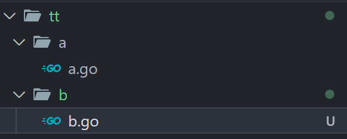
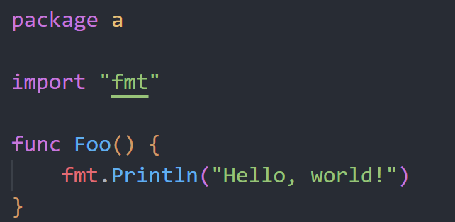

## **项目创建**

* 在项目文件夹下创建模块
  
  ```
  go mod init <模块名称>
  ```
  
  <mark>会在当前文件夹下生成一个.mod文件</mark>

        <u>**可以嵌套使用，即可以在模块的二级目录下再创建一个mod，但不推荐**</u>

* go同一个文件夹下的所有 .go 文件是互相可见的，即可以直接使用其它 .go 文件的函数和变量

        <u>**go没有类，如果要写类的话推荐一个类一个.go文件，即可实现私有变量和公开变量的封装（<mark>仅在不同的包能够实现封装</mark>）**</u>

* 如果要引入当前项目下不在同一文件夹的变量、函数Or 结构体， 需要在文件开头import该文件 <mark>大小写问题仅出现在不同的包内</mark>

       **<u>go语言必须要有一个package main 且main函数必须在这个package。</u>**

        **<u>同一个目录下只能使用一个package名字，注意，main是无法被导入的。</u>**

       **<u> Package main中的多个文件是不会自动被导入的（尽管写的时候没有报错）， 这时候如果使用 </u>**

```
go run main.go
```

会出现undefined错误，这时得用

```
go run .
```

---

样例： 在tt目录下已经

```
go mod init tt
```



a文件夹下定义Foo()函数，并且包名为a。<mark> 注意大写开头</mark>



   b文件夹下想要调用a的Foo() 函数就需要

```go
import “tt/a”
func B(){
    a.Foo()
} 
```

    这个 tt/a 中的a以包名为准


---

## **类的构建**

首先，go 没有类，但是可以像 C 一样给结构体定义函数来构建一个类。

注意：

* go的结构体是默认<mark>深拷贝</mark>的，但是js和ts是默认<mark>浅拷贝</mark>的，所以写起来可能会有割裂感（在使用<mark>map等stl容器时注意要存的是指针而不是本身</mark>）

* 方法定义时有两种形式 
  
  ```go
  func (this Test) foo(){}
  func (this *Test) foo(){}
  ```
  
  前者是将Test拷贝一份作为参数传入foo [<mark>这时无法更改Test内容</mark>] ，后者是直接将Test指针传入foo [<mark>这时可以更改</mark>]

<mark>样例在tt文件夹中</mark>
